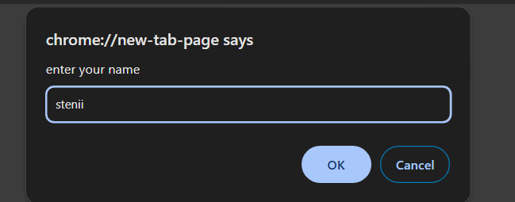

##  1.What are the variable naming conventions in JavaScript?

##  Ans:a.variables are case sensitive.
## b.variable cane single character or multiple charater or alpha numeric.
## c.variable is declared with also an underscore or $.
## d.variable cannot start with a number.
## e.cannot use keywords as variables.

## 2.2.	 Create a greeting alert (use => prompt, message, alert)
 
 ##  Ans:let a= prompt ("enter your name");
 ## alert("good morning "+a)
 
 

## 3.3.	 Write some code so that the values of the below variables switch around  Let fish = “fly”, let bird = “swim”. Switch the value so that fish holds the value “swim” and the variable bird holds the value “fly”

## Ans: let fish = "fly"
## let bird = "swim"
## let c = bird
## bird=fish
## fish=c
## console.log(fish)
## console.log(bird)

## Quiz

   